# Outcognito — Complete System Architecture

## 1. Purpose of This Document

This document explains the complete architecture of Outcognito from browser activity to the final social feed.

It covers:

- the complete system,
- Person A responsibilities,
- Person B responsibilities,
- internal browser-extension architecture,
- privacy architecture,
- event architecture,
- authentication and pairing,
- local development architecture,
- production AWS architecture,
- storage architecture,
- AI reaction architecture,
- API flow,
- error handling,
- scaling boundaries,
- end-to-end flowcharts.

The objective is to make sure both teammates understand:

```text
what each component does
↓
why it exists
↓
where it lives
↓
what data it receives
↓
what data it outputs
↓
how it connects to the next component
```

---

# 2. High-Level Product Architecture

Outcognito has two major systems.

## System A — Browser Intelligence Layer

Owned mainly by **Person A**.

This system runs inside the user's Chrome/Chromium browser.

Responsibilities:

- observe safe browser behavior,
- normalize domain information,
- ignore sensitive domains,
- track tab/window/idle behavior,
- maintain local short-term behavioral memory,
- detect behavioral patterns,
- calculate roastability,
- create safe events,
- validate events,
- send events to backend.

---

## System B — Social + AI Platform

Owned mainly by **Person B**.

Responsibilities:

- authenticate users,
- connect extension to user account,
- receive browser events,
- validate events,
- save behavioral memory,
- decide if an event becomes public,
- generate AI character reactions,
- select memes,
- save posts/comments,
- display social feed.

---

# 3. Complete System Overview

```mermaid
flowchart LR

    U[User Browsing] --> A1[Chrome Extension]

    subgraph PERSON_A["Person A — Browser Extension"]
        A1 --> A2[Privacy Firewall]
        A2 --> A3[Activity Tracking]
        A3 --> A4[Local Behavioral Memory]
        A4 --> A5[Pattern Engine]
        A5 --> A6[Roastability Engine]
        A6 --> A7[Event Factory]
        A7 --> A8[Zod Validation]
        A8 --> A9[API Client]
    end

    A9 --> API[POST /events]

    subgraph PERSON_B["Person B — Backend + AI + Social Platform"]
        API --> B1[API Gateway / Backend]
        B1 --> B2[Auth Validation]
        B2 --> B3[Zod Event Validation]
        B3 --> B4[Event Memory]
        B4 --> B5{Roastability >= Publish Threshold?}
        B5 -->|No| B6[Store Memory Only]
        B5 -->|Yes| B7[Comment Director]
        B7 --> B8[AI Personality Engine]
        B8 --> B9[Meme Selector]
        B9 --> B10[Create Post]
        B10 --> B11[Feed Database]
    end

    B11 --> W[Outcognito Website]
    W --> U
```

---

# 4. Architectural Principle

The most important architectural rule is:

```text
Person A does not send raw browsing content.

Person A sends only privacy-safe behavioral events.
```

The backend should never need to know what exact page text the user saw.

Example:

Bad architecture:

```text
User opens:
https://chatgpt.com/c/secret-project-question

Extension sends entire URL
↓
Backend tries to infer behavior
```

Correct architecture:

```text
Extension locally sees:
chatgpt.com

Extension categorizes:
AI

Extension detects:
5 AI returns in 20 minutes

Extension sends:
{
  eventType: "ai_dependency",
  category: "ai",
  count: 5
}
```

This makes Person A's extension the **privacy boundary** of the system.

---

# 5. Person A Architecture

Person A owns this pipeline:

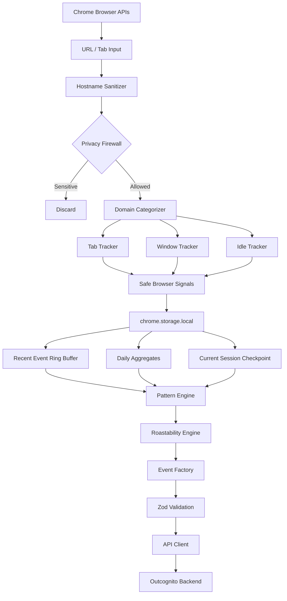

---

# 6. Extension Internal Modules

Recommended internal architecture:

```text
apps/extension/
│
├── background/
│   └── service-worker.ts
│
├── tracking/
│   ├── tabTracker.ts
│   ├── windowTracker.ts
│   ├── idleTracker.ts
│   ├── durationTracker.ts
│   └── domainCategories.ts
│
├── privacy/
│   ├── hostname.ts
│   ├── firewall.ts
│   └── defaultIgnoredDomains.ts
│
├── storage/
│   ├── storage.ts
│   └── defaults.ts
│
├── patterns/
│   ├── patternEngine.ts
│   ├── relapse.ts
│   ├── giveUp.ts
│   ├── tabInsanity.ts
│   ├── aiDependency.ts
│   ├── distraction.ts
│   └── roastability.ts
│
├── events/
│   └── createEvent.ts
│
├── api/
│   └── client.ts
│
├── auth/
│   └── pairing.ts
│
├── popup/
│   ├── popup.html
│   ├── popup.css
│   └── popup.ts
│
├── config/
│   └── environment.ts
│
└── types/
    └── index.ts
```

---

# 7. Service Worker Architecture

The service worker is the central coordinator.

File:

```text
src/background/service-worker.ts
```

Responsibilities:

- register Chrome event listeners,
- initialize alarms,
- restore persisted state,
- receive external pairing messages,
- call tracking modules,
- invoke pattern engine,
- send validated events.

Important:

Manifest V3 service workers are not permanent background processes.

Therefore:

```text
DO NOT
store important session state only in variables
```

Wrong:

```ts
let tabSwitchCount = 0;
let currentTabStartedAt = Date.now();
```

because the service worker can be suspended.

Correct:

```text
chrome.storage.local
```

is the source of truth.

---

# 8. Durable State Architecture

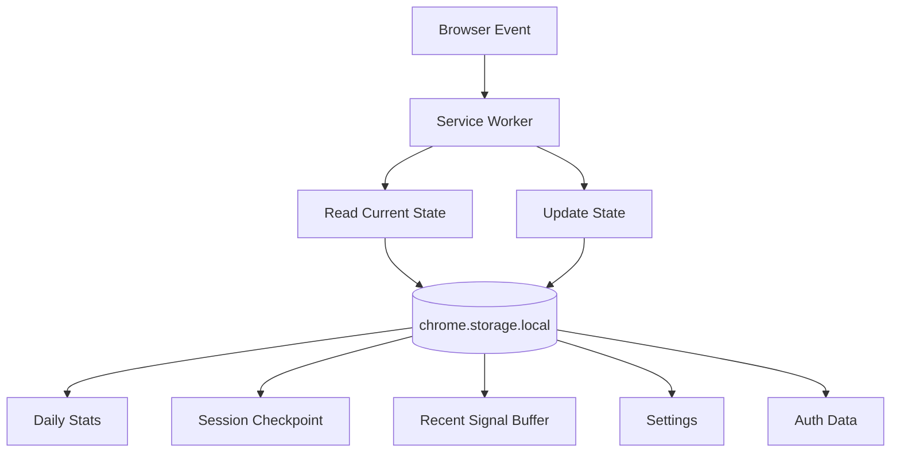

---

# 9. Recommended Extension State

Example logical state:

```ts
interface ExtensionState {
  settings: {
    enabled: boolean;
    ignoredDomains: string[];
  };

  session: {
    currentDomain?: string;
    currentCategory?: string;
    tabStartedAt?: number;
    browserFocused: boolean;
    userIdle: boolean;
  };

  dailyStats: {
    date: string;
    tabSwitches: number;
    activeSeconds: number;
    aiVisits: number;
    domainsVisited: Record<string, number>;
    categorySeconds: Record<string, number>;
  };

  recentSignals: BrowserSignal[];

  auth: {
    authToken?: string;
    pairedAt?: string;
  };
}
```

---

# 10. Why a Ring Buffer is Required

Do not store unlimited browsing signals.

Bad:

```text
event 1
event 2
event 3
...
event 100000
```

This causes:

- growing storage,
- privacy risk,
- slower pattern checks,
- unnecessary history.

Instead:

```text
MAX_RECENT_SIGNALS = 200
```

Architecture:

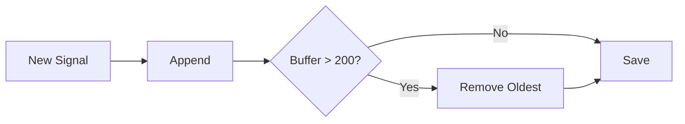

This produces short-term behavioral memory without building a browsing-history database.

---

# 11. Privacy Architecture

Privacy filtering happens before behavioral logic.

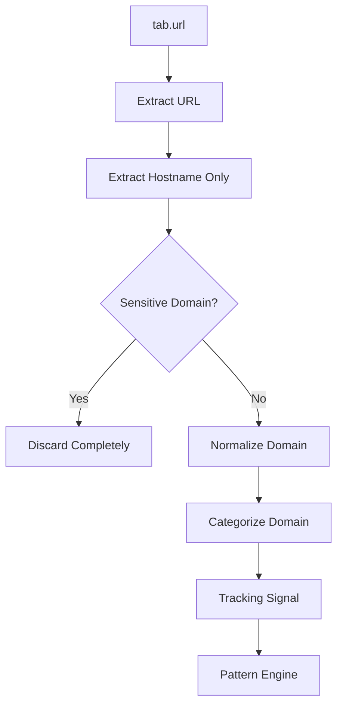

---

# 12. Privacy Firewall Rules

Allowed example:

```text
https://www.youtube.com/watch?v=123
```

Temporary local processing:

```text
youtube.com
```

Stored:

```text
youtube.com
```

Never store:

```text
/watch?v=123
```

Never send:

```text
video title
comments
search query
page contents
```

---

# 13. Sensitive Domains

Default ignored categories should include:

```text
Banking
Payments
Email
Authentication
Password Managers
Cloud Storage
Government Identity Portals
Health portals if identified
Other obviously sensitive services
```

Architecture:

```text
incoming hostname
↓
default ignored list
↓
user ignored list
↓
allowed?
```

If no:

```text
stop immediately
```

---

# 14. Tracking Architecture

Three major trackers work together.

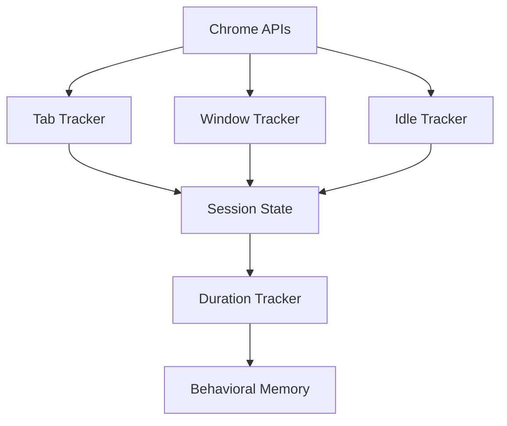

---

# 15. Tab Tracker

Uses:

```ts
chrome.tabs.onActivated
chrome.tabs.onUpdated
```

Responsibilities:

- detect tab switches,
- detect active hostname change,
- finalize previous domain duration,
- start new domain duration,
- increment relevant counters.

Flow:

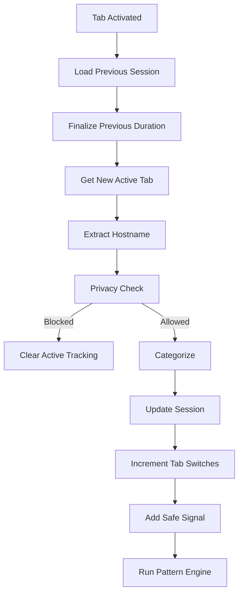

---

# 16. Window Tracker

Uses:

```ts
chrome.windows.onFocusChanged
```

Reason:

If the user switches from Chrome to another program, Outcognito should not continue counting browser usage as active time.

Flow:

```text
Chrome focused
→ count browser duration

Chrome unfocused
→ finalize current duration
→ pause active timing
```

---

# 17. Idle Tracker

Uses:

```ts
chrome.idle.onStateChanged
```

States:

```text
active
idle
locked
```

Flow:

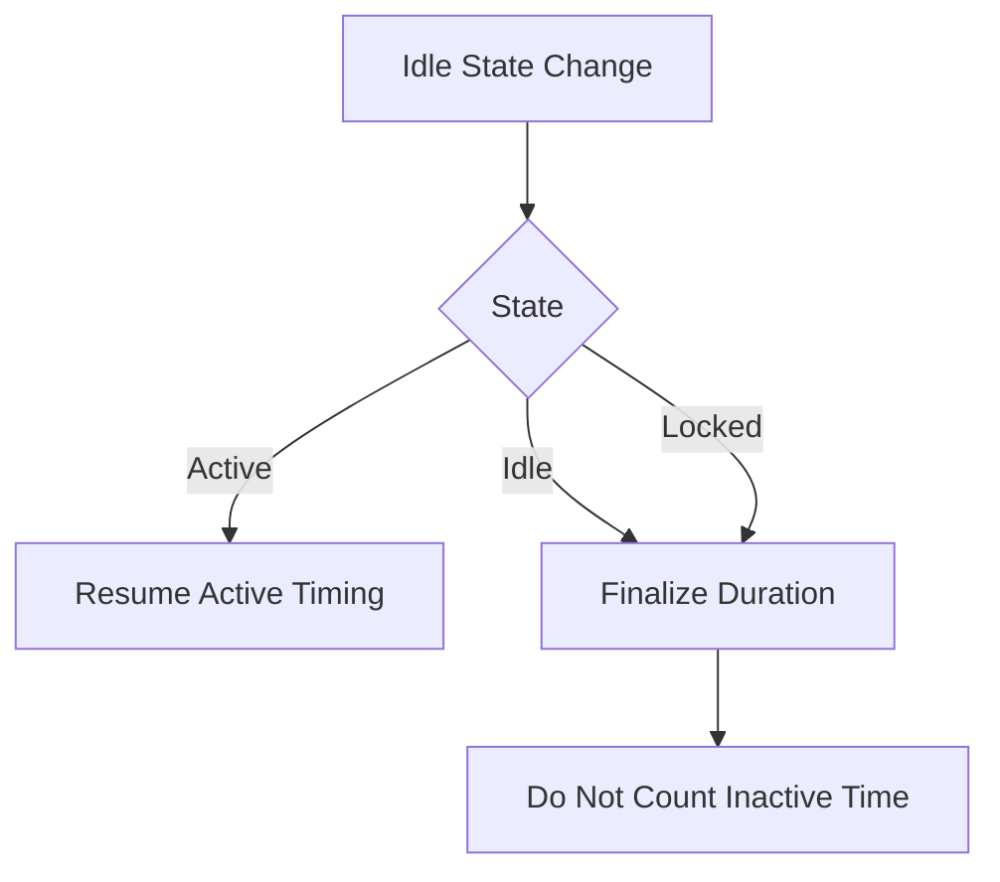

---

# 18. Browser Signal Model

Pattern Engine should consume safe internal signals.

Example:

```ts
interface BrowserSignal {
  type:
    | "domain_enter"
    | "domain_leave"
    | "tab_switch"
    | "window_focus"
    | "window_blur";

  domain?: string;
  category?: EventCategory;
  timestamp: string;
  durationSeconds?: number;
}
```

Important:

This object should never contain page content.

---

# 19. Domain Categorization Architecture

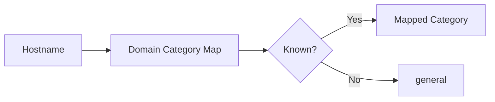

Categories:

```text
development
ai
social
entertainment
productivity
shopping
general
```

Example:

```text
github.com
→ development

chatgpt.com
→ ai

instagram.com
→ social

youtube.com
→ entertainment
```

---

# 20. Behavioral Memory Architecture

Person A should not store a complete browsing history.

Instead store:

## Recent Signals

Used for short-window patterns.

Example:

```text
last 200 signals
```

## Daily Aggregates

Used for summary statistics.

Example:

```text
tab switches
AI visits
time by category
time by domain
```

## Session Checkpoint

Used to survive service-worker suspension.

Example:

```text
currentDomain
currentCategory
tabStartedAt
```

---

# 21. Pattern Engine Architecture

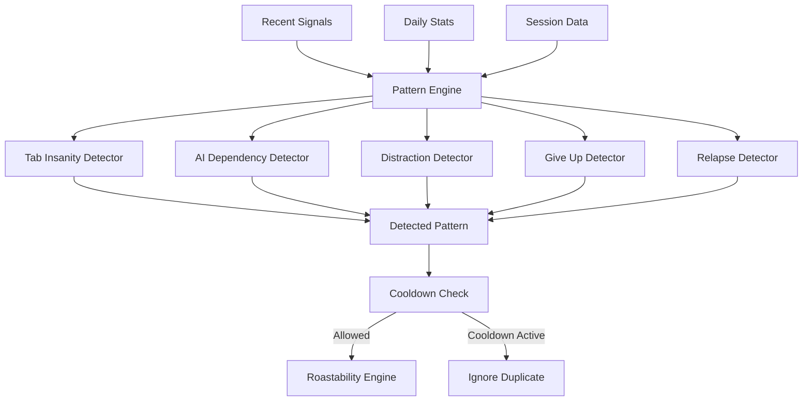

---

# 22. Tab Insanity Pattern

Example condition:

```text
18+ tab switches
within
60 seconds
```

Input:

```text
tab_switch
tab_switch
tab_switch
...
```

Output:

```json
{
  "eventType": "tab_insanity",
  "count": 18
}
```

---

# 23. AI Dependency Pattern

Example:

```text
AI category entered >= 5 times
during a 20 minute work window
```

This should mean:

```text
frequent AI returns
```

not:

```text
we know what the user asked AI
```

The system never sees the prompts.

---

# 24. Distraction Pattern

Example transition:

```text
development
↓
entertainment
↓
development
↓
social
↓
development
↓
entertainment
```

If repeated enough in a time window:

```text
distraction event
```

---

# 25. Give-Up Pattern

This is only a heuristic name.

Possible rule:

```text
>= N minutes development/productivity
followed by
>= M minutes entertainment/social
```

Person A should not infer emotional state.

The event can be framed as behavioral switching.

---

# 26. Relapse Pattern

Example:

```text
entertainment domain
↓
leave
↓
return shortly
↓
leave
↓
return again
```

Could generate:

```text
repeated distraction return
```

---

# 27. Pattern Cooldown Architecture

Without cooldown:

```text
18 switches
→ event

19 switches
→ event

20 switches
→ event

21 switches
→ event
```

Bad.

With cooldown:

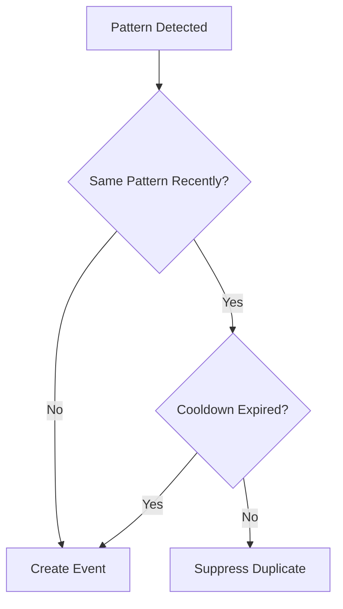

---

# 28. Roastability Architecture

Person A calculates a local rule-based score.

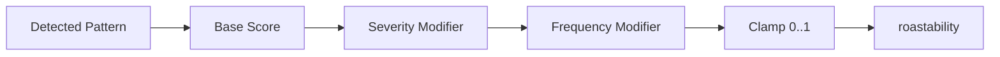

Example:

```text
Tab insanity

base = 0.55

+ additional score
based on switches beyond threshold

maximum = 0.95
```

---

# 29. Important Roastability Rule

Person A does not decide public visibility.

Person A:

```text
detect
↓
score
↓
send
```

Person B:

```text
receive
↓
store memory
↓
compare score against threshold
↓
publish or memory-only
```

This matters because low-score events may still be useful for future AI context.

---

# 30. Event Factory Architecture

All detected patterns must go through one event factory.

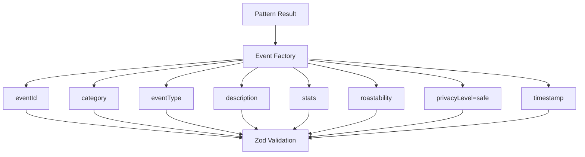

---

# 31. Shared Event Contract

Canonical event:

```ts
{
  eventId: string,

  category:
    | "development"
    | "ai"
    | "social"
    | "entertainment"
    | "productivity"
    | "shopping"
    | "general",

  eventType: string,

  description: string,

  stats?: {
    occurrence?: number,
    durationSeconds?: number,
    count?: number
  },

  roastability: number,

  privacyLevel: "safe",

  timestamp: string
}
```

---

# 32. Why Runtime Validation Matters

TypeScript only checks code while developing.

It does not guarantee runtime JSON is valid.

Therefore:

```text
Person A
Zod validate before POST

Person B
Zod validate after receiving POST
```

Architecture:

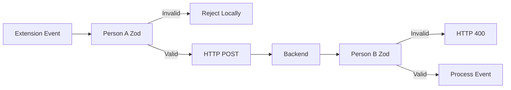

---

# 33. API Client Architecture

Person A API client:

```text
src/api/client.ts
```

Responsibilities:

- build request,
- attach auth token,
- preserve eventId on retry,
- call `/events`,
- handle network errors,
- handle authentication errors,
- return result to extension.

Flow:

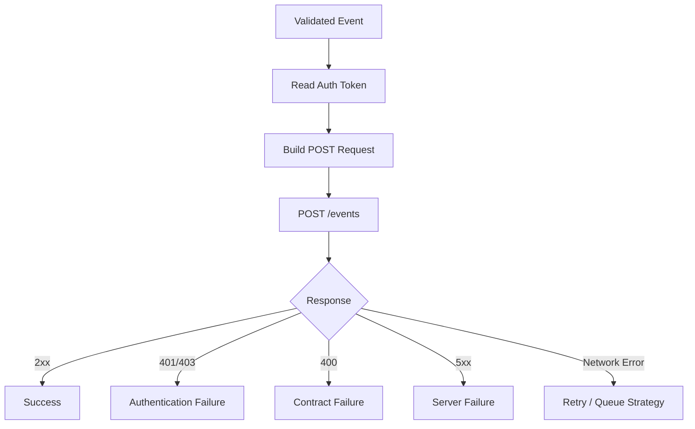

---

# 34. API Base Architecture

Use one configuration:

```text
API_BASE
```

Development:

```text
http://localhost:4000
```

Production:

```text
AWS API Gateway
```

Architecture:

```text
sendEvent()
↓
API_BASE + "/events"
```

Not:

```text
hardcoded URLs in multiple files
```

---

# 35. Local Development Architecture

Before AWS:

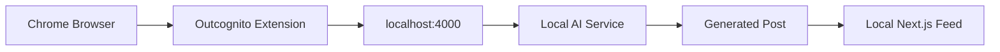

This proves the complete product idea without cloud complexity.

---

# 36. Local Integration Milestone

The first real project milestone:

```text
Open ChatGPT
↓
Extension detects AI domain
↓
Pattern Engine creates event
↓
Event validated
↓
POST localhost:4000/events
↓
Backend receives event
↓
AI generates character comments
↓
Post appears locally
```

When this works once:

```text
Outcognito exists.
```

Everything after this is infrastructure and polish.

---

# 37. Pairing Architecture

The website cannot directly write into `chrome.storage`.

Therefore pairing uses external extension messaging.

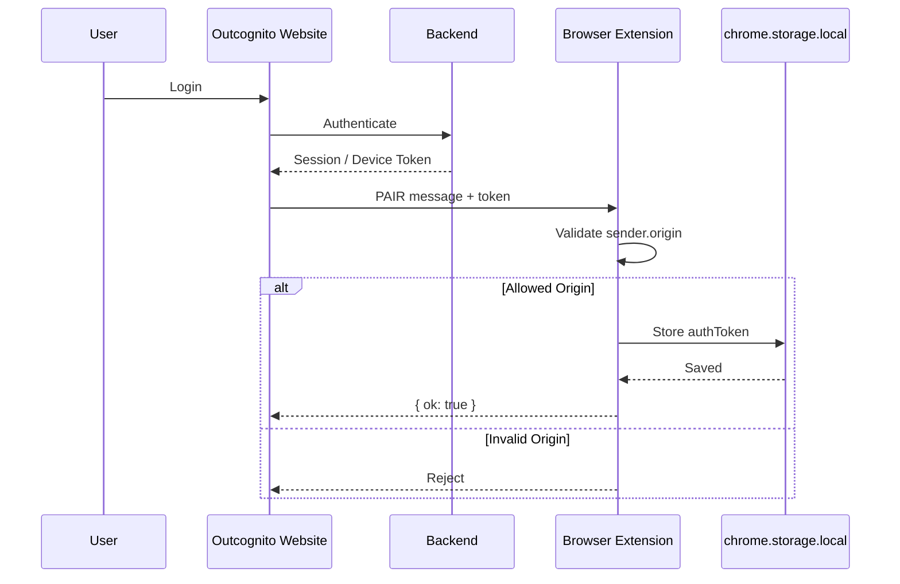

---

# 38. Pairing Security

The extension must accept external messages only from:

```text
production Outcognito domain
localhost development site
```

Never:

```text
any website
```

Manifest:

```json
{
  "externally_connectable": {
    "matches": [
      "https://outcognito.com/*",
      "http://localhost:3000/*"
    ]
  }
}
```

Extension also checks:

```text
sender.origin
```

This gives defense in depth.

---

# 39. Authentication Flow

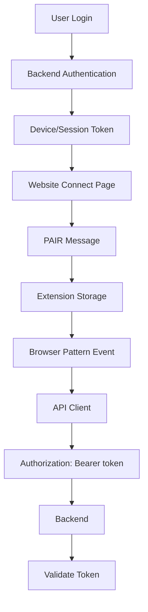

---

# 40. Person B Backend Architecture

Person B's rough server-side pipeline:

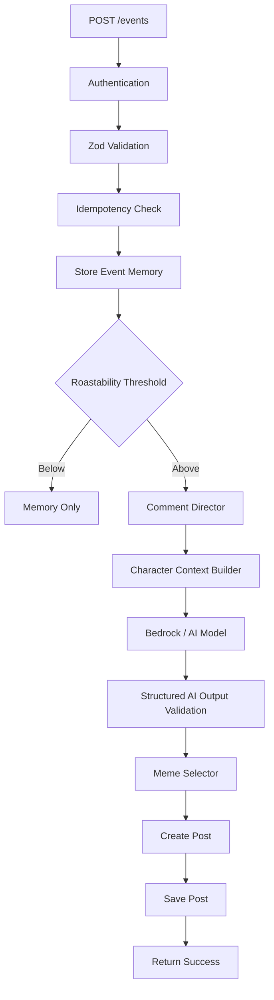

---

# 41. Event Idempotency Architecture

Person A generates:

```text
eventId
```

Once.

If request fails:

```text
retry same event
with same eventId
```

Person B:

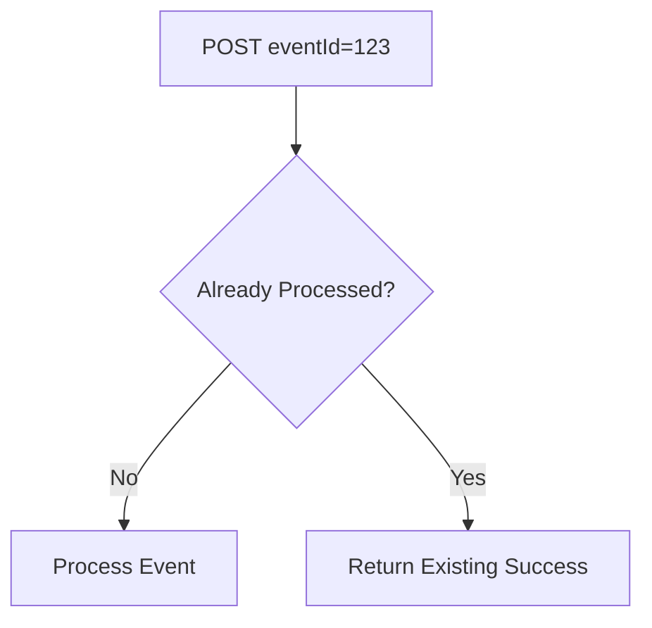

This prevents duplicate posts.

---

# 42. AI Memory Architecture

Backend should store useful behavior summaries.

Not raw browsing content.

Example memory:

```text
User triggered AI dependency 3 times this week.
Previous tab-insanity record: 23 switches/minute.
```

Character context:

```text
3 recent memories
+
2 relevant older memories
```

Then sent into one AI generation call.

---

# 43. Character Reaction Architecture

Recommended:

```mermaid
flowchart TD

    E[Behavior Event] --> D[Comment Director]

    D --> S[Select Relevant Characters]

    S --> C[Build Shared Prompt]

    C --> M[Single AI Model Call]

    M --> J[Structured JSON Response]

    J --> V[Zod Validate AI Output]

    V --> P[Character Comments + Replies]
```

Important:

Use one model call per event when possible.

Not:

```text
7 characters
=
7 separate expensive model calls
```

---

# 44. AI Personality Architecture

Each character should have a configuration.

Example:

```json
{
  "characterId": "detective",
  "name": "Detective",
  "tone": [
    "observant",
    "dry",
    "accusatory"
  ],
  "interests": [
    "behavior patterns",
    "contradictions"
  ],
  "relationships": {
    "chaos": "rival"
  },
  "memePreferences": [
    "detective",
    "sus",
    "caught"
  ]
}
```

Personality configuration:

```text
event
+
behavior memory
+
character configuration
=
reaction prompt
```

---

# 45. Meme Architecture

Meme retrieval should happen after text generation works.

```mermaid
flowchart LR

    A[AI Reaction] --> B[Extract Tags]
    C[Event Category] --> B

    B --> D[Meme Metadata Search]
    D --> E[Best Matching Asset]
    E --> F[Attach to Post]
```

V1:

```text
keyword/tag matching
```

Not:

```text
complex vector search
```

unless time remains.

---

# 46. Production AWS Architecture

Recommended cloud structure:

```mermaid
flowchart LR

    E[Chrome Extension]

    E --> G[API Gateway]
    G --> L[Lambda]

    L --> C[Cognito / Token Validation]
    L --> D[(DynamoDB)]
    L --> B[Amazon Bedrock]

    B --> L

    L --> S3[S3 Meme Assets]

    W[Next.js Web App] --> A[Amplify / Web Hosting]
    A --> G

    S3 --> CF[CloudFront]
    CF --> W

    D --> L
```

---

# 47. AWS Component Responsibilities

## API Gateway

Purpose:

- public API entry,
- route requests,
- CORS,
- rate limiting.

Endpoints may include:

```text
POST /events
POST /devices/connect
GET /feed
GET /profile
POST /reactions
POST /comments
```

---

## Lambda

Purpose:

- validate events,
- apply business rules,
- invoke AI,
- store data,
- build responses.

---

## Cognito

Purpose:

- account authentication,
- user session/JWT management.

---

## DynamoDB

Purpose:

- users,
- devices,
- posts,
- comments,
- reactions,
- AI memory.

---

## Bedrock

Purpose:

- generate AI character conversations.

---

## S3

Purpose:

- meme assets,
- static media.

---

## CloudFront

Purpose:

- fast media delivery.

---

## Amplify / Hosting

Purpose:

- host Next.js web application if chosen.

---

# 48. DynamoDB Logical Architecture

Recommended tables for hackathon speed:

```text
USERS
DEVICES
POSTS
COMMENTS
REACTIONS
AI_MEMORY
```

---

# 49. USERS

Primary key:

```text
userId
```

Contains:

```text
username
profile data
createdAt
settings
```

---

# 50. DEVICES

Primary key:

```text
deviceId
```

Index:

```text
userId
```

Contains:

```text
userId
device metadata
connectedAt
lastSeen
```

---

# 51. POSTS

Primary key:

```text
postId
```

Indexes:

```text
userId + createdAt
feedShard + createdAt
```

Used for:

```text
profile feed
global feed
```

---

# 52. COMMENTS

Primary key:

```text
commentId
```

Index:

```text
postId + createdAt
```

---

# 53. REACTIONS

Possible composite identifier:

```text
postId#userId
```

Prevents duplicate reactions by same user.

---

# 54. AI_MEMORY

Primary key:

```text
userId#characterId
```

Contains capped relevant memories.

Do not create unlimited memory.

---

# 55. Backend Event Decision Flow

```mermaid
flowchart TD

    A[Receive Event] --> B[Validate Auth]
    B --> C[Validate Schema]
    C --> D[Check eventId Duplicate]

    D --> E[Store Behavioral Memory]

    E --> F{Roastability >= 0.60?}

    F -->|No| G[No Public Post]
    F -->|Yes| H[Generate AI Reactions]

    H --> I[Optional Meme]
    I --> J[Create Post]
    J --> K[Feed]
```

Threshold can be adjusted later.

---

# 56. Complete End-to-End Sequence

```mermaid
sequenceDiagram

    participant U as User
    participant C as Chrome
    participant E as Extension
    participant S as Local Storage
    participant API as Backend API
    participant DB as Database
    participant AI as AI Engine
    participant W as Website

    U->>C: Browse website
    C->>E: Tab activation/update

    E->>E: Extract hostname
    E->>E: Privacy firewall

    alt Sensitive Domain
        E-->>C: Ignore activity
    else Allowed Domain
        E->>E: Categorize domain
        E->>S: Update session + stats
        E->>S: Add recent signal
        E->>E: Pattern detection

        alt No Pattern
            E-->>C: Continue monitoring
        else Pattern Found
            E->>E: Calculate roastability
            E->>E: Create OutcognitoEvent
            E->>E: Zod validate event
            E->>API: POST /events + Bearer token

            API->>API: Authenticate
            API->>API: Zod validate
            API->>DB: Store event memory

            alt Below Publish Threshold
                API-->>E: Accepted
            else Publishable
                API->>AI: Generate reactions
                AI-->>API: Character thread
                API->>DB: Store post/comments
                API-->>E: Accepted
                W->>API: GET feed
                API->>DB: Read posts
                DB-->>API: Feed data
                API-->>W: Feed data
                W-->>U: Show AI roast
            end
        end
    end
```

---

# 57. Popup Architecture

Popup is a control panel, not the tracking engine.

```mermaid
flowchart TD

    P[Popup Opens] --> S[Read chrome.storage.local]

    S --> A[Monitoring Status]
    S --> B[Connection Status]
    S --> C[Daily Stats]
    S --> D[Privacy Status]

    A --> UI[Render Popup]
    B --> UI
    C --> UI
    D --> UI

    UI --> X[Pause / Resume]
    X --> S
```

---

# 58. Pause Architecture

When user pauses:

```text
settings.enabled = false
```

Every tracker checks:

```text
enabled?
```

before recording.

Correct:

```mermaid
flowchart TD

    A[Browser Event] --> B{Monitoring Enabled?}

    B -->|No| C[Ignore]
    B -->|Yes| D[Privacy Firewall]
```

Incorrect:

```text
UI says paused
but background tracker keeps collecting
```

---

# 59. Failure Handling Architecture

Outcognito should degrade gracefully.

---

# 60. Backend Offline

```mermaid
flowchart TD

    A[Event Ready] --> B[POST /events]
    B --> C{Network Available?}

    C -->|Yes| D[Send]
    C -->|No| E[Handle Failure]
    E --> F[Keep Extension Running]
```

The extension must not crash because backend is unavailable.

---

# 61. Invalid Token

```text
POST
↓
401
↓
mark connection state invalid
↓
user reconnects account
```

---

# 62. Invalid Event

Person A validation should prevent most malformed events.

If backend still returns:

```text
400
```

log development error.

Do not retry endlessly.

---

# 63. Backend Server Error

For:

```text
500 / 502 / 503
```

limited retry can be used.

Never infinite retry.

---

# 64. Service Worker Suspension

Expected behavior:

```text
service worker stops
↓
Chrome wakes it on event
↓
service worker loads stored state
↓
tracking continues
```

This is why persistent storage is essential.

---

# 65. Browser Restart

Persistent:

```text
settings
ignored domains
auth
daily aggregate
```

Transient timing must resume carefully.

Do not assume time while Chrome was closed counts as browsing time.

---

# 66. Security Boundaries

There are four important trust boundaries.

```mermaid
flowchart LR

    B[Web Page] -->|Boundary 1| E[Extension]
    E -->|Boundary 2| API[Backend]
    API -->|Boundary 3| AI[AI Model]
    API -->|Boundary 4| DB[(Database)]
```

---

# 67. Boundary 1 — Website to Extension

Threat:

```text
random website attempts PAIR
```

Protection:

```text
externally_connectable
+
sender.origin validation
```

---

# 68. Boundary 2 — Extension to Backend

Threat:

```text
malformed requests
stolen/invalid token
spam
```

Protection:

```text
JWT/device token
Zod validation
rate limiting
eventId idempotency
```

---

# 69. Boundary 3 — Backend to AI

Threat:

```text
invalid structured output
unexpected model response
```

Protection:

```text
structured JSON prompt
Zod validate AI output
fallback canned response
```

---

# 70. Boundary 4 — Backend to Database

Threat:

```text
duplicate records
unbounded memory
```

Protection:

```text
explicit keys
event deduplication
capped memory
```

---

# 71. Repository Architecture

Recommended monorepo:

```text
outcognito/
│
├── apps/
│   ├── extension/
│   │   └── Person A
│   │
│   └── web/
│       └── Person B
│
├── packages/
│   └── event-schema/
│       └── Shared
│
├── services/
│   ├── backend/
│   │   └── Person B
│   │
│   └── ai/
│       └── Person B
│
├── docs/
│   ├── about.md
│   ├── architecture.md
│   ├── build.md
│   └── requirements.md
│
└── README.md
```

---

# 72. Ownership Boundary

```mermaid
flowchart LR

    subgraph A["Person A"]
        A1[Extension]
        A2[Privacy]
        A3[Tracking]
        A4[Patterns]
        A5[Event Validation]
        A6[API Client]
    end

    subgraph SHARED["Shared"]
        S1[Event Schema]
        S2[API Contract]
        S3[Pairing Contract]
    end

    subgraph B["Person B"]
        B1[Backend]
        B2[AI]
        B3[Database]
        B4[Website]
        B5[AWS]
    end

    A --> SHARED
    SHARED --> B
```

---

# 73. Shared Contracts That Must Not Change Randomly

Both teammates must agree before changes to:

```text
OutcognitoEvent fields
category names
event type naming
POST /events path
Authorization format
PAIR message format
API response format
```

Any breaking change must be discussed first.

---

# 74. Recommended API Response

Successful event:

```json
{
  "ok": true,
  "eventId": "uuid"
}
```

Duplicate event:

```json
{
  "ok": true,
  "eventId": "uuid",
  "duplicate": true
}
```

Bad event:

```json
{
  "ok": false,
  "error": "INVALID_EVENT"
}
```

Auth failure:

```json
{
  "ok": false,
  "error": "UNAUTHORIZED"
}
```

---

# 75. Development Order Architecture

```mermaid
flowchart TD

    P0[Phase 0 Shared Contract]
    P1[Phase 1 Extension Skeleton]
    P2[Phase 2 Persistent Storage]
    P3[Phase 3 Privacy Firewall]
    P4[Phase 4 Domain Categorization]
    P5[Phase 5 Tracking]
    P6[Phase 6 Behavioral Memory]
    P7[Phase 7 Pattern Engine]
    P8[Phase 8 Roastability]
    P9[Phase 9 Event Factory]
    P10[Phase 10 Local API Bridge]
    P11[Phase 11 Popup]
    P12[Phase 12 Pairing]
    P13[Phase 13 AWS Swap]
    P14[Phase 14 Reliability]
    P15[Phase 15 Polish]

    P0 --> P1 --> P2 --> P3 --> P4 --> P5 --> P6 --> P7 --> P8 --> P9 --> P10 --> P11 --> P12 --> P13 --> P14 --> P15
```

---

# 76. MVP Architecture

Absolute minimum:

```mermaid
flowchart LR

    A[Browser] --> B[Extension]
    B --> C[Domain Tracking]
    C --> D[Privacy Filter]
    D --> E[One Pattern]
    E --> F[Validated Event]
    F --> G[Local Backend]
    G --> H[AI Reaction]
```

This is enough to prove the concept.

---

# 77. Full Hackathon Architecture

```mermaid
flowchart LR

    USER[User]

    USER --> EXT[Chrome Extension]

    EXT --> PRIV[Privacy Firewall]
    PRIV --> TRACK[Tracking Engine]
    TRACK --> MEMORY[Local Memory]
    MEMORY --> PATTERN[Pattern Engine]
    PATTERN --> SCORE[Roastability]
    SCORE --> EVENT[Event Factory]
    EVENT --> VALIDATE[Zod]
    VALIDATE --> CLIENT[API Client]

    CLIENT --> GW[API Gateway]
    GW --> AUTH[Cognito/Auth]
    GW --> LAMBDA[Lambda]

    LAMBDA --> DDB[(DynamoDB)]
    LAMBDA --> BEDROCK[Bedrock]
    LAMBDA --> S3[S3 Memes]

    BEDROCK --> LAMBDA
    S3 --> LAMBDA

    LAMBDA --> POST[Post Creation]
    POST --> DDB

    WEB[Next.js Web] --> GW
    WEB --> USER
```

---

# 78. Data Minimization Flow

```mermaid
flowchart TD

    RAW[Raw Browser URL Exists Temporarily]
    RAW --> HOST[Hostname Extracted]
    HOST --> ERASE[Discard Path / Query]
    ERASE --> PRIV[Privacy Check]
    PRIV --> CAT[Category]
    CAT --> SIGNAL[Safe Signal]
    SIGNAL --> PATTERN[Behavior Pattern]
    PATTERN --> EVENT[Safe Event]
    EVENT --> API[Backend]

    style RAW stroke-dasharray: 5 5
```

The important architectural idea:

```text
the farther data travels,
the less sensitive it becomes.
```

---

# 79. Data That Stays Local

Prefer to keep:

```text
raw tab URL before hostname extraction
ignored-domain matching logic
recent safe signal buffer
daily browser aggregates
user local exclusions
```

---

# 80. Data That Can Leave Extension

Only safe event information such as:

```text
eventId
category
eventType
abstract description
aggregated stats
roastability
privacyLevel
timestamp
```

---

# 81. Data That Must Never Leave Extension in V1

```text
full URL
query string
page text
messages
emails
passwords
form contents
clipboard
keystrokes
screenshots
documents
```

---

# 82. Scalability Architecture

V1 is intentionally simple.

At hackathon scale:

```text
extension
→ API Gateway
→ Lambda
→ DynamoDB
→ Bedrock
```

is sufficient.

Future scale could introduce:

```text
queue
event processing workers
streaming
analytics pipeline
vector memory
multi-region deployment
```

Do not build these during V1.

---

# 83. Future Event Queue Architecture

Only future reference:

```mermaid
flowchart LR

    A[API Gateway] --> B[Lambda Ingest]
    B --> Q[SQS/Event Queue]
    Q --> P[AI Worker]
    P --> D[(Database)]
```

This would help if AI generation becomes slow or traffic grows.

Not required now.

---

# 84. Future Cross-Browser Architecture

Future:

```text
Shared Core Logic
├── Chrome Adapter
├── Edge Adapter
├── Brave Adapter
└── Firefox Adapter
```

V1:

```text
Chrome/Chromium only
```

Do not prematurely abstract this.

---

# 85. Architectural Risks

## Risk 1 — MV3 Service Worker State Loss

Mitigation:

```text
chrome.storage.local
+
session checkpoints
```

---

## Risk 2 — Privacy Mistake

Mitigation:

```text
no content scripts
hostname-only storage
ignored domain firewall
```

---

## Risk 3 — Pairing Failure

Mitigation:

```text
externally_connectable
stable dev extension ID
origin validation
```

---

## Risk 4 — Person A / Person B Contract Drift

Mitigation:

```text
shared Zod package
```

---

## Risk 5 — Pattern Spam

Mitigation:

```text
cooldowns
eventId
backend idempotency
```

---

## Risk 6 — AI Cost

Mitigation:

```text
one model call per event
publish threshold
rate limiting
```

---

## Risk 7 — AWS Integration Consumes Hackathon

Mitigation:

```text
prove local end-to-end first
then replace API_BASE
```

---

# 86. Architecture Decision Summary

| Decision | Choice |
|---|---|
| Browser platform | Chrome / Chromium |
| Extension standard | Manifest V3 |
| Extension language | TypeScript |
| Extension UI | HTML + CSS + TS |
| Page-content access | None |
| Persistence | chrome.storage.local |
| Periodic work | chrome.alarms |
| Browser behavior inputs | tabs + windows + idle |
| Event validation | Zod |
| Local backend | localhost:4000 |
| Website | Next.js |
| Backend | AWS Lambda/API |
| Authentication | Cognito / token-based |
| Database | DynamoDB |
| AI | Amazon Bedrock |
| Meme storage | S3 |
| CDN | CloudFront |
| Shared boundary | OutcognitoEvent schema |
| AI calls | Prefer one per event |
| Client filtering by roastability | No |
| Server publish threshold | Yes |
| Raw browsing history | Never |
| Content scripts | Not in V1 |

---

# 87. Final Architecture Summary

The complete architecture is:

```text
USER BROWSING
     ↓
CHROME EXTENSION
     ↓
HOSTNAME SANITIZER
     ↓
PRIVACY FIREWALL
     ↓
DOMAIN CATEGORIZATION
     ↓
TAB / WINDOW / IDLE TRACKING
     ↓
PERSISTENT LOCAL MEMORY
     ↓
PATTERN ENGINE
     ↓
ROASTABILITY ENGINE
     ↓
EVENT FACTORY
     ↓
ZOD VALIDATION
     ↓
API CLIENT
     ↓
AUTHENTICATED POST /events
     ↓
BACKEND VALIDATION
     ↓
EVENT MEMORY
     ↓
PUBLICATION DECISION
     ↓
COMMENT DIRECTOR
     ↓
AI PERSONALITY ENGINE
     ↓
MEME SELECTION
     ↓
POST + COMMENTS
     ↓
DATABASE
     ↓
OUTCOGNITO SOCIAL FEED
     ↓
USER
```

---

# 88. Person A's Exact Architectural Boundary

Person A starts here:

```text
Chrome emits browser event
```

Person A ends here:

```text
validated OutcognitoEvent successfully reaches backend
```

Everything in between is Person A's responsibility.

```mermaid
flowchart LR

    START[Chrome Browser Event]

    START --> PRIV[Privacy]
    PRIV --> TRACK[Tracking]
    TRACK --> STORE[Persistent State]
    STORE --> PATTERN[Pattern Detection]
    PATTERN --> SCORE[Roastability]
    SCORE --> EVENT[Event Factory]
    EVENT --> VALIDATE[Zod Validation]
    VALIDATE --> API[API Client]

    API --> BOUNDARY[Backend Receives Event]

    style BOUNDARY stroke-width:4px
```

That is the cleanest way to think about your role:

> **Your job is to turn browser behavior into a safe, reliable, validated event that Person B can trust.**

