# Outcognito — ZENTHORIAX Architecture

This document contains only the architecture for **ZENTHORIAX's work**.

---

# 1. ZENTHORIAX Architectural Boundary

Your responsibility starts here:

```text
Chrome browser event
```

and ends here:

```text
validated OutcognitoEvent reaches backend
```

Full boundary:

```mermaid
flowchart LR

    A[Chrome Browser Event]
    A --> B[Monitoring State Check]
    B --> C[Hostname Sanitizer]
    C --> D[Privacy Firewall]
    D --> E[Domain Categorizer]
    E --> F[Tracking Engine]
    F --> G[Persistent Local State]
    G --> H[Pattern Engine]
    H --> I[Roastability Engine]
    I --> J[Event Factory]
    J --> K[Zod Validation]
    K --> L[API Client]
    L --> M[Backend Receives Valid Event]
```

---

# 2. Internal Extension Architecture

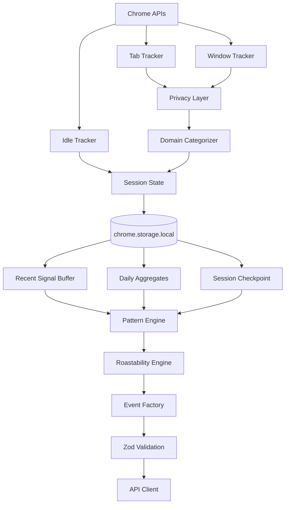

---

# 3. Module Architecture

```text
apps/extension/
│
├── background/
│   └── service-worker.ts
│
├── tracking/
│   ├── tabTracker.ts
│   ├── windowTracker.ts
│   ├── idleTracker.ts
│   ├── durationTracker.ts
│   └── domainCategories.ts
│
├── privacy/
│   ├── hostname.ts
│   ├── firewall.ts
│   └── defaultIgnoredDomains.ts
│
├── storage/
│   ├── storage.ts
│   └── defaults.ts
│
├── patterns/
│   ├── patternEngine.ts
│   ├── tabInsanity.ts
│   ├── aiDependency.ts
│   ├── distraction.ts
│   ├── giveUp.ts
│   ├── relapse.ts
│   └── roastability.ts
│
├── events/
│   └── createEvent.ts
│
├── api/
│   └── client.ts
│
├── auth/
│   └── pairing.ts
│
├── popup/
│   ├── popup.html
│   ├── popup.css
│   └── popup.ts
│
└── config/
    └── environment.ts
```

---

# 4. Service Worker Architecture

The service worker coordinates the entire extension.

Responsibilities:

```text
register Chrome listeners
initialize alarms
restore state
handle browser events
handle pairing messages
trigger pattern engine
send events
```

Important:

Do not assume the service worker stays alive.

---

# 5. Persistent State Architecture

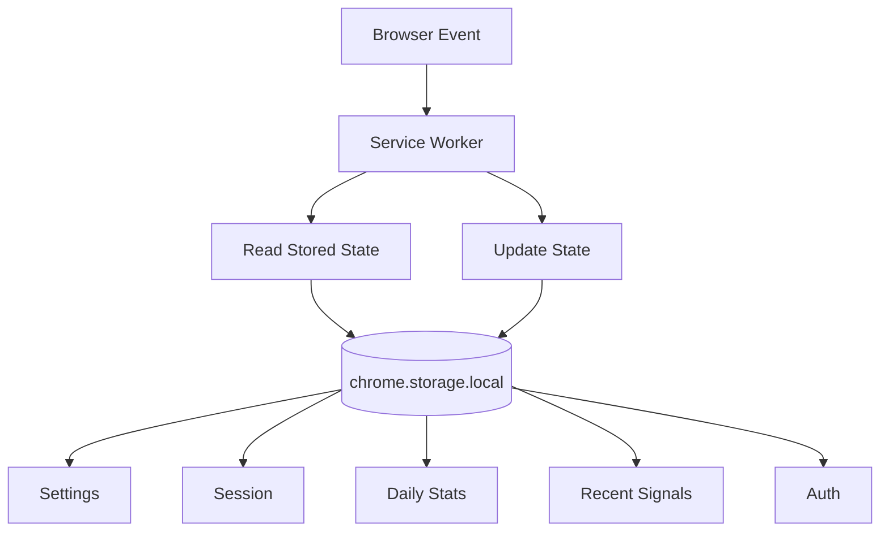

Suggested logical state:

```ts
interface ExtensionState {
  settings: {
    enabled: boolean;
    ignoredDomains: string[];
  };

  session: {
    currentDomain?: string;
    currentCategory?: string;
    tabStartedAt?: number;
    browserFocused: boolean;
    userIdle: boolean;
  };

  dailyStats: {
    date: string;
    tabSwitches: number;
    activeSeconds: number;
    aiVisits: number;
    domainsVisited: Record<string, number>;
    categorySeconds: Record<string, number>;
  };

  recentSignals: BrowserSignal[];

  auth: {
    authToken?: string;
    pairedAt?: string;
  };
}
```

---

# 6. Ring Buffer Architecture

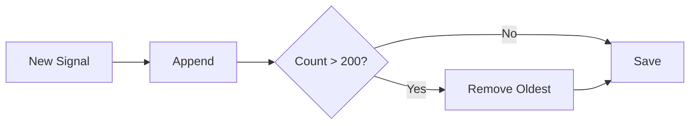

Purpose:

- bounded storage
- reduced privacy risk
- faster pattern checks

---

# 7. Privacy Architecture

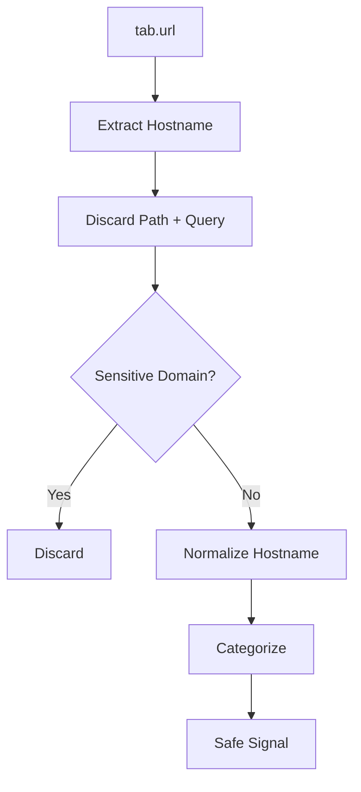

---

# 8. Privacy Rules

Allowed local result:

```text
youtube.com
```

Not allowed:

```text
https://youtube.com/watch?v=...
```

Never collect:

```text
page text
inputs
messages
emails
passwords
clipboard
screenshots
keystrokes
```

---

# 9. Tracking Architecture

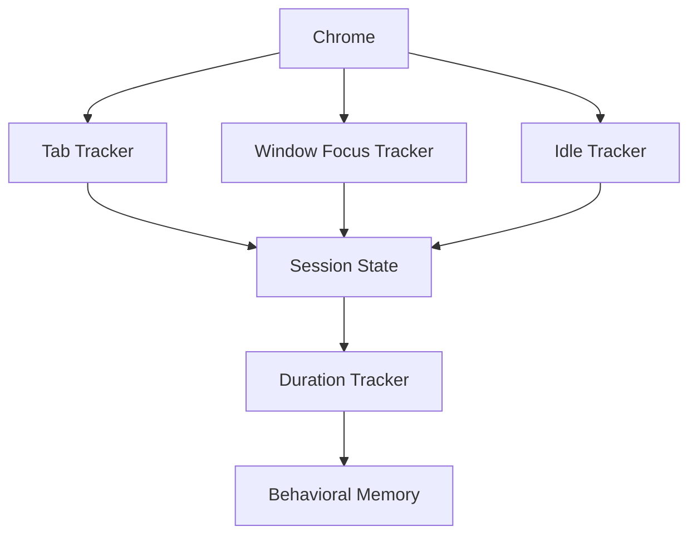

---

# 10. Tab Tracker Flow

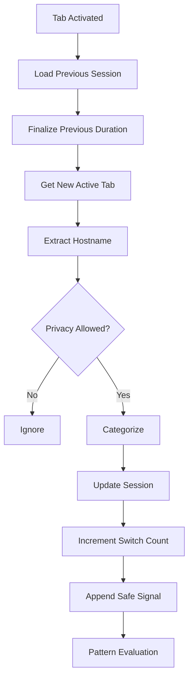

---

# 11. Window Focus Flow

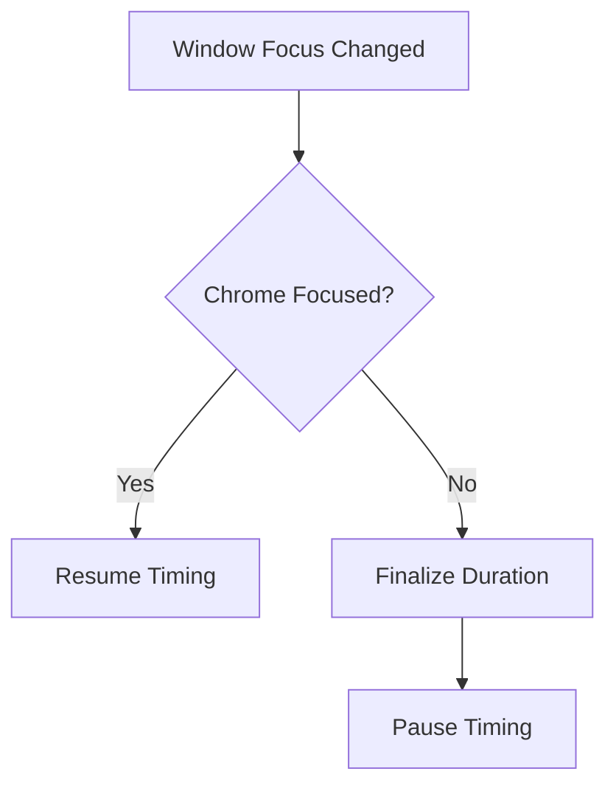

---

# 12. Idle Flow

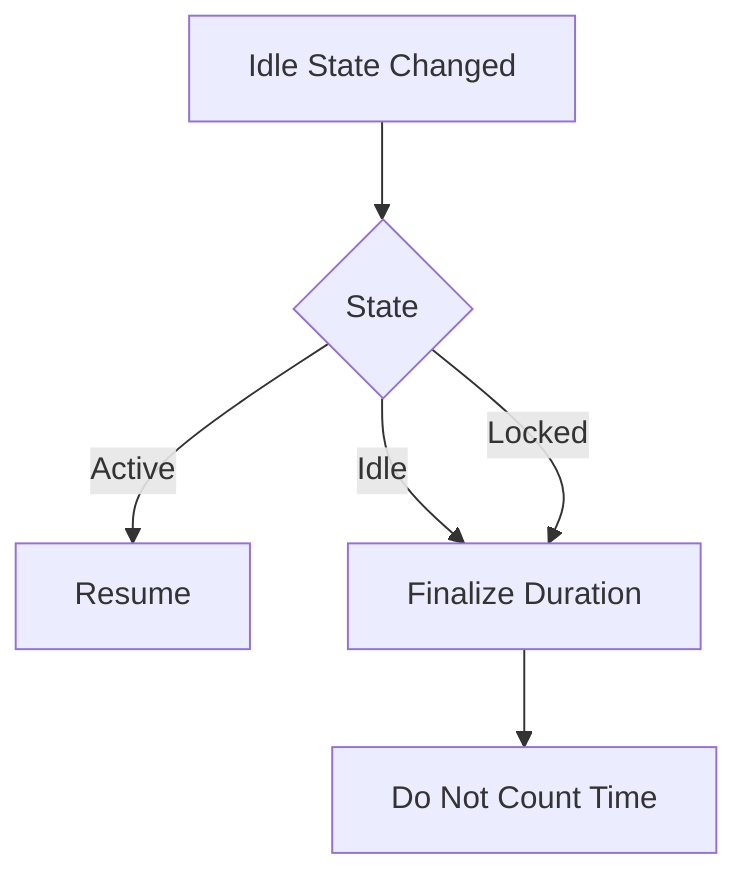

---

# 13. Safe Browser Signal

Example internal type:

```ts
interface BrowserSignal {
  type:
    | "domain_enter"
    | "domain_leave"
    | "tab_switch"
    | "window_focus"
    | "window_blur";

  domain?: string;
  category?: EventCategory;
  timestamp: string;
  durationSeconds?: number;
}
```

No page content allowed.

---

# 14. Domain Categorization Flow

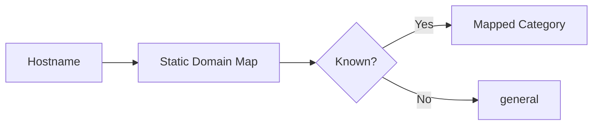

---

# 15. Behavioral Memory Architecture

Three layers:

```text
recent signals
daily aggregates
session checkpoint
```

## Recent signals

Used for short pattern windows.

## Daily aggregates

Used for:

```text
tab switches
category time
domain time
AI visits
return counts
```

## Session checkpoint

Used to recover after service-worker suspension.

---

# 16. Pattern Engine Architecture

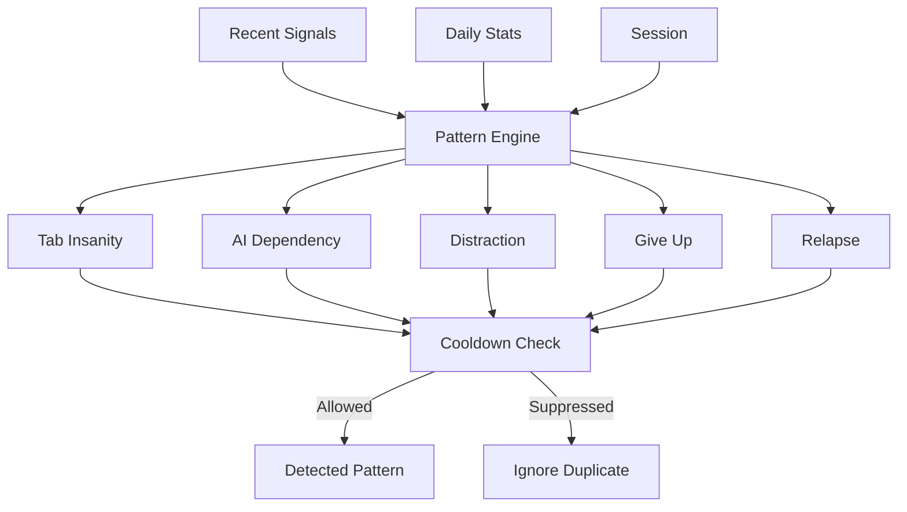

---

# 17. Tab Insanity

Example:

```text
18+ tab switches in 60 seconds
```

---

# 18. AI Dependency

Example:

```text
5+ AI-category entries in 20 minutes
```

---

# 19. Distraction

Example:

```text
development
→ entertainment
→ development
→ social
→ development
→ entertainment
```

---

# 20. Give Up

Heuristic:

```text
productive period
→ sustained entertainment/social period
```

Behavior only, not emotional inference.

---

# 21. Relapse

Example:

```text
leave distraction
→ return
→ leave
→ return again
```

---

# 22. Cooldown Architecture

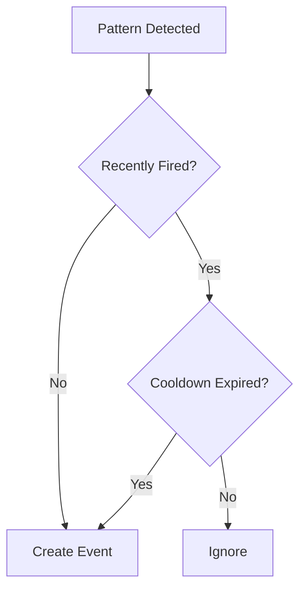

---

# 23. Roastability Architecture

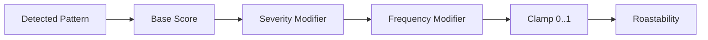

Rule-based only.

No AI model inside extension.

---

# 24. Event Factory Architecture

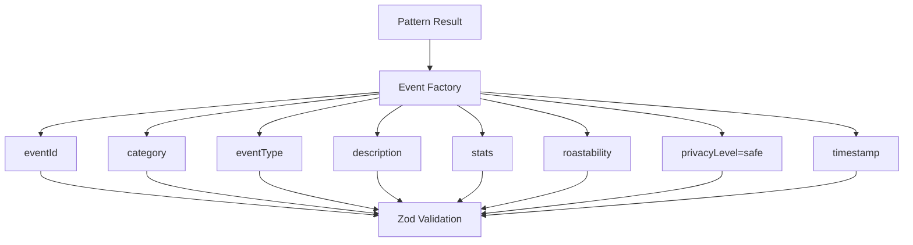

---

# 25. Event Contract

```ts
{
  eventId: string,
  category:
    | "development"
    | "ai"
    | "social"
    | "entertainment"
    | "productivity"
    | "shopping"
    | "general",
  eventType: string,
  description: string,
  stats?: {
    occurrence?: number,
    durationSeconds?: number,
    count?: number
  },
  roastability: number,
  privacyLevel: "safe",
  timestamp: string
}
```

---

# 26. Validation Architecture

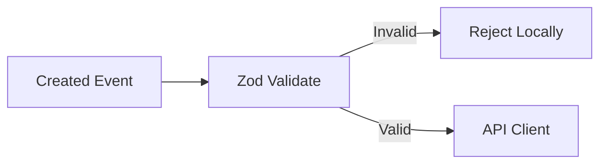

---

# 27. API Client Architecture

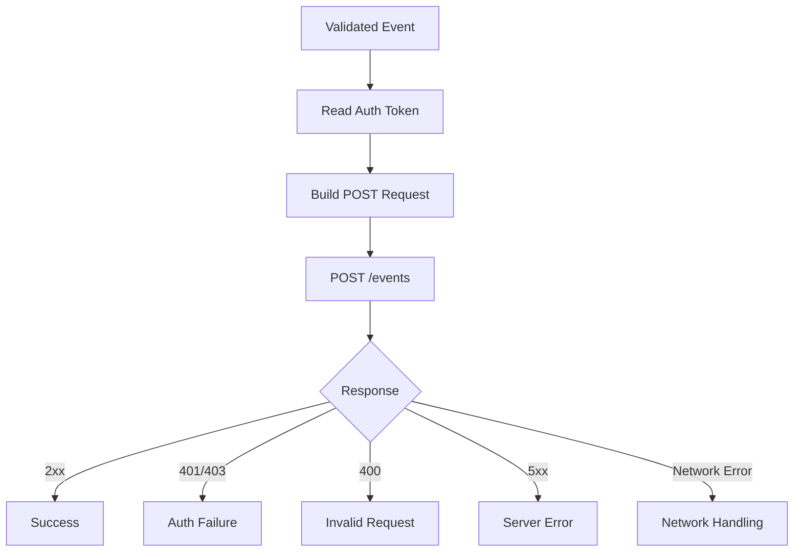

---

# 28. Environment Architecture

One config:

```text
API_BASE
```

Development:

```text
http://localhost:4000
```

Production:

```text
real backend API origin
```

Do not hardcode URLs in multiple files.

---

# 29. Local Development Flow

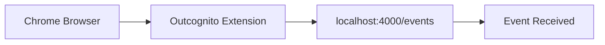

This is your first major integration target.

---

# 30. Pairing Architecture

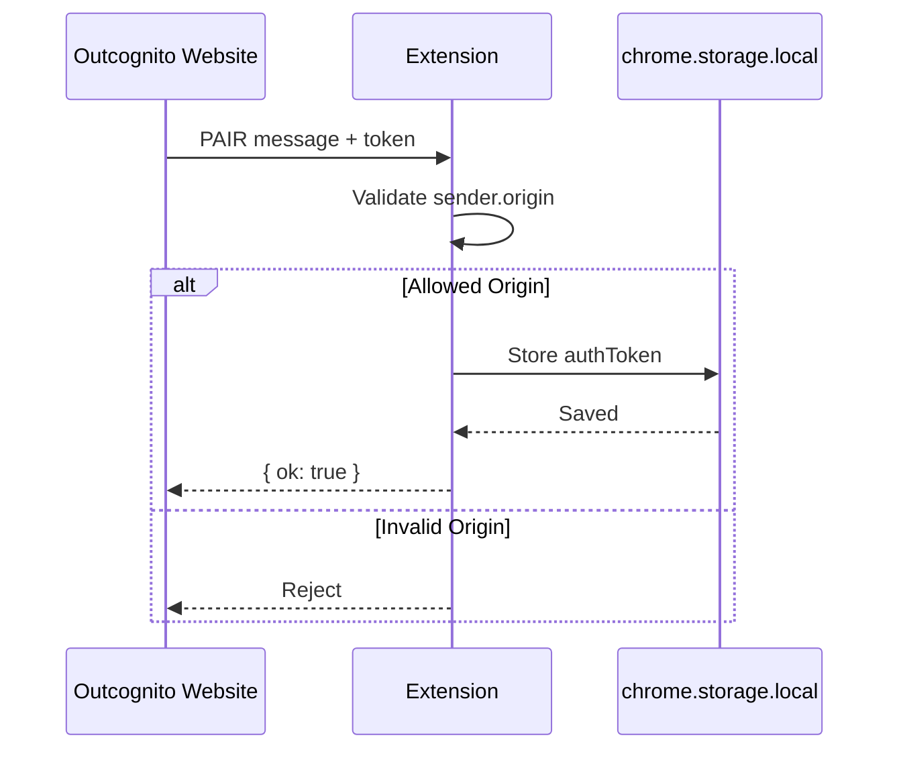

---

# 31. Pairing Security

Allowed origins:

```text
https://outcognito.com
http://localhost:3000
```

Use both:

```text
externally_connectable
sender.origin validation
```

---

# 32. Authentication Flow

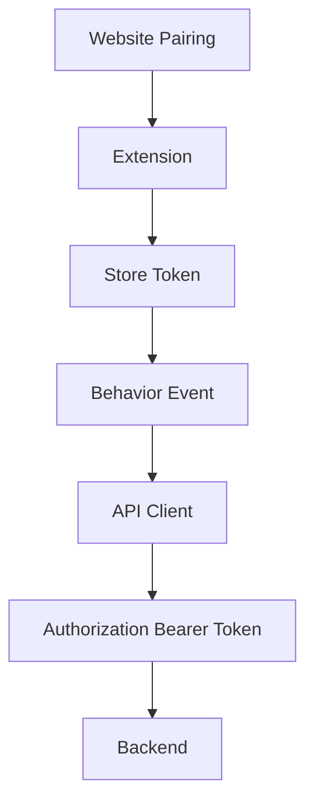

---

# 33. Popup Architecture

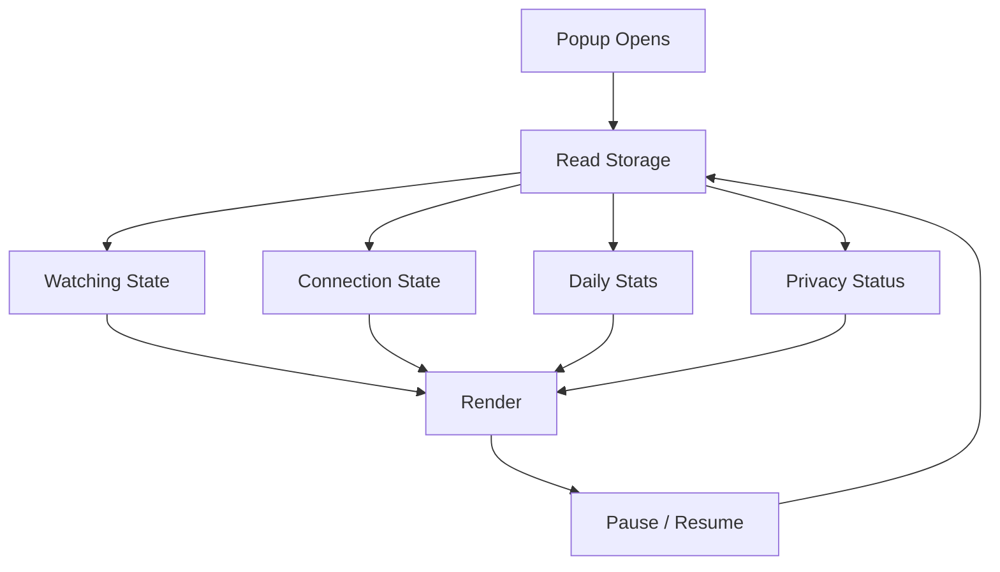

---

# 34. Pause Flow

```mermaid
flowchart TD

    E[Browser Event]
    E --> M{Monitoring Enabled?}
    M -->|No| I[Ignore]
    M -->|Yes| P[Privacy Firewall]
```

Pause must stop tracking, not just change UI.

---

# 35. Service Worker Recovery

```text
service worker suspended
↓
Chrome wakes worker on browser event
↓
load session from chrome.storage.local
↓
continue tracking
```

---

# 36. Browser Restart Recovery

Persistent:

```text
settings
auth
daily aggregates
ignored domains
```

Do not count Chrome-closed time as browsing duration.

---

# 37. Failure Handling

## Backend unavailable

```text
send fails
↓
extension stays operational
```

## Invalid token

```text
401/403
↓
mark disconnected
↓
require reconnect
```

## Invalid event

```text
Zod reject locally
```

## Server 5xx

Use limited retry.

Never infinite retry.

---

# 38. Security Boundaries

```mermaid
flowchart LR

    W[Website]
    W -->|External Messaging Boundary| E[Extension]
    E -->|Authenticated API Boundary| B[Backend]
```

Your job is to secure both extension-side boundaries.

---

# 39. Repository Ownership

ZENTHORIAX owns:

```text
apps/extension/
```

and participates in:

```text
packages/event-schema/
```

---

# 40. Development Architecture

```mermaid
flowchart TD

    P0[Schema]
    P1[MV3 Skeleton]
    P2[Storage]
    P3[Privacy]
    P4[Categorization]
    P5[Tab Tracking]
    P6[Window Tracking]
    P7[Idle Tracking]
    P8[Duration]
    P9[Behavioral Memory]
    P10[Pattern Engine]
    P11[Roastability]
    P12[Event Factory]
    P13[Local API]
    P14[Popup]
    P15[Pairing]
    P16[Authenticated API]
    P17[Cloud Swap]
    P18[Reliability]
    P19[Polish]

    P0 --> P1 --> P2 --> P3 --> P4 --> P5 --> P6 --> P7 --> P8 --> P9 --> P10 --> P11 --> P12 --> P13 --> P14 --> P15 --> P16 --> P17 --> P18 --> P19
```

---

# 41. ZENTHORIAX MVP Architecture

```mermaid
flowchart LR

    A[Browser]
    A --> B[Extension]
    B --> C[Privacy]
    C --> D[Tracking]
    D --> E[One Pattern]
    E --> F[Validated Event]
    F --> G[Local Backend]
```

This is enough to prove your side works.

---

# 42. Final Architecture Summary

```text
Chrome Browser Event
        ↓
Monitoring Enabled?
        ↓
Hostname Sanitization
        ↓
Privacy Firewall
        ↓
Domain Categorization
        ↓
Tab / Window / Idle Tracking
        ↓
Persistent Local State
        ↓
Behavioral Memory
        ↓
Pattern Engine
        ↓
Cooldown Check
        ↓
Roastability
        ↓
Event Factory
        ↓
Zod Validation
        ↓
Read Auth Token
        ↓
POST /events
        ↓
Backend Receives Valid Event
```

---

# 43. ZENTHORIAX Responsibility Statement

> **ZENTHORIAX owns the complete privacy-safe browser intelligence pipeline from Chrome activity to validated event delivery.**
